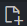
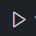

> `*.md`格式是Markdown格式，需要Markdown的阅读器才能正确显示。
> 所以我们先下载可以阅读markdown格式的阅读器，这个角色可以用[VSCode](https://code.visualstudio.com/download)代替
> 所以在进行下面的步骤时，当安装完`markdown preview enhanced`后，使用`VSCode`重新打开本文件
> 在文件的空白处右键，选择`MPE:打开侧边预览`

# 准备工作
1. 安装[VSCode](https://code.visualstudio.com/download)
> 在下一步之前保证已经安装了[VSCode](https://code.visualstudio.com/download)
2. 安装插件
   1. [Chinese （简体中文）](https://marketplace.visualstudio.com/items?itemName=MS-CEINTL.vscode-language-pack-zh-hans)
        - 用于中文支持
   2. [Markdown All in One](https://marketplace.visualstudio.com/items?itemName=yzhang.markdown-all-in-one)
        - Markdown的支持
   3. [markdown preview enhanced](https://marketplace.visualstudio.com/items?itemName=shd101wyy.markdown-preview-enhanced)
        - Markdown预览
   4. [python](https://marketplace.visualstudio.com/items?itemName=ms-python.python)
        - python适配
   5. [python debugger](https://marketplace.visualstudio.com/items?itemName=ms-python.debugpy)
        - python调试
   6. [python indent](https://marketplace.visualstudio.com/items?itemName=KevinRose.vsc-python-indent)
        - python换行与缩进 增强codding体验
   7. [pylance](https://marketplace.visualstudio.com/items?itemName=ms-python.vscode-pylance)
        - 语言服务器 增强代码补全和智能感知 提供静态类型检测等
   8. [isort](https://marketplace.visualstudio.com/items?itemName=ms-python.isort)
         - `Shift + Alt + O`对导入模块排序
   9.  [Black Formatter](https://marketplace.visualstudio.com/items?itemName=ms-python.black-formatter)
        - black风格的代码格式化
   10. [GitLens — Git supercharged](https://marketplace.visualstudio.com/items?itemName=eamodio.gitlens)
        - git拓展
   11. [git graph](https://marketplace.visualstudio.com/items?itemName=mhutchie.git-graph)
        - git线路图显示
   12. [TONGYI AI](https://marketplace.visualstudio.com/items?itemName=Alibaba-Cloud.tongyi-lingma)
        - 通义灵码 使用通义千问模型的智能代码提示
   13. [better comments](https://marketplace.visualstudio.com/items?itemName=aaron-bond.better-comments)
        - 对`!` `?` `*` `TODO` `双重注释` 等特殊注释增加额外的显示效果
   14. [bookmarks](https://marketplace.visualstudio.com/items?itemName=alefragnani.Bookmarks)
        - 书签 方便快速跳转
   15. [todo tree](https://marketplace.visualstudio.com/items?itemName=Gruntfuggly.todo-tree)
        - 对于`TODO`注释自动形成树状结构 方便快速查看和跳转
   16. [code spell checker](https://marketplace.visualstudio.com/items?itemName=streetsidesoftware.code-spell-checker)
        - 拼写检查 选中对应的词 右键 找到对应的选项 可以添加词到字典中
   17. [prettier](https://marketplace.visualstudio.com/items?itemName=SimonSiefke.prettier-vscode)
        - 对`JavaScript、TypeScript、Flow、JSX、JSON、CSS、SCSS、Less、HTML、Vue、Angular、GraphQL、Markdown、YAML、C#、Elm、Java、Twig、XML、Svelte、Php`代码进行格式化
   18. [path intellisense](https://marketplace.visualstudio.com/items?itemName=christian-kohler.path-intellisense)
        - 路径智能提示
   19. [live server](https://marketplace.visualstudio.com/items?itemName=ritwickdey.LiveServer)
        -  启动一个本地服务器，用来预览网页(HTML文件)
3. 安装`python`环境
   1. 进入[python官网](https://www.python.org/downloads/)
   2. python可以多个版本共存
   3. 我们使用`python3.11.9` [点我直接下载](https://www.python.org/downloads/release/python-3119/)
   4. 在安装时勾选`Add PATH`(或类似字样的选择)
4. 创建一个干净的文件夹
5. 打开`VSCode`
6. 从左上角的 `文件` 选择 `打开文件夹` 选择刚刚创建的文件夹
7. 在左侧的`资源管理器`中点击`新建文件`的按钮({width='20px'})
8. 创建文件`test.py`
9.  输入`print("hello world")`
10. 按下`F5` 选择 `python debugger` 然后选择 `python 文件`
11. 如果控制台显示`hello world` 则说明安装成功

# 运行python代码
> 运行python代码有很多方式
> 本质上都是调用`python`解释器
> 下面不带数字，一条就是一种方法，不是分步操作哦
> 带数字的才需要分步操作
- 在`VSCode`中运行
  - `F5` -> `python debugger` -> `python 文件`
  - 点击`运行`按钮({width='20px'})
- 不使用`VSCode`
  1. 打开你喜欢的终端(一般电脑上都有的`cmd`，你可以使用`Win+R`输入`cmd`打开)
  2. 进入你想要运行的文件夹例如输入`cd D:\python\test`并回车
  3. 如果你的电脑上有多个python的版本，你需要具体指定哪个版本的`python`解释器路径
  4. 例如: `C:\Users\Administrator\AppData\Local\Programs\Python\Python311\python.exe script.py`
  5. 上面的例子是使用了位于上述路径的的`python` 来运行` D:\python\test\script.py`文件
