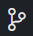
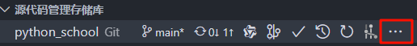

# GuiHub 简介

GitHub 是一个全球领先的面向开源及私有软件项目的托管平台，它成立于 2008 年 4 月 10 日，特别设计用于使用 Git 版本控制系统进行代码存储和版本管理。GitHub 不仅仅是一个代码仓库，它还集成了众多促进软件开发和协作的功能，使其成为开发者社区的中心枢纽。

**核心特点包括：**

1. **代码托管**：用户可以创建公开或私有的代码仓库，用于存储代码、文档和其他开发项目。Git 的分布式特性确保了代码的安全性和版本历史的完整性。

2. **版本控制**：利用 Git 的强大功能，GitHub 使团队能够轻松追踪每一次代码更改、合并分支、解决冲突，并能回滚到之前的版本。

3. **协作工具**：GitHub 提供了一系列协作工具，如议题（Issues）用于跟踪错误和特性请求，拉取请求（Pull Requests）用于审查和合并代码改动，以及项目看板（Projects boards）来管理任务和工作流。

4. **社交编程**：用户可以关注其他开发者或项目，参与讨论，收到关于自己项目的反馈，甚至直接为开源项目贡献代码，形成了一种独特的社交化编程环境。

5. **开源生态系统**：GitHub 是世界上最大的开源代码库之一，托管着数百万个项目，包括 Ruby on Rails、jQuery、Python 等知名开源软件。这使得它成为寻找开源软件、学习新技术和贡献代码的首选之地。

6. **其他功能**：还包括代码片段分享（Gists）、代码搜索、文本渲染（如 Markdown）、在线文件编辑器、持续集成/部署（CI/CD）集成、代码安全扫描等。

7. **组织与团队管理**：企业或组织可以在 GitHub 上创建账号，管理成员权限，进行团队协作，以及使用 GitHub 的高级特性，如 GitHub Actions 进行自动化工作流程设置。

8. **教育与社区支持**：GitHub 还致力于教育和培养开发者社区，提供学生优惠计划、教程资源以及社区论坛等支持。

2018 年，微软以 75 亿美元收购了 GitHub，但 GitHub 保持了其独立运营的模式，并继续发展其服务，强化了其在开发者工具和服务领域的地位。如今，GitHub 拥有超过 1 亿的开发者用户和 400 多万组织机构，成为了软件开发不可或缺的一部分。

# 注册账号

请查阅该[链接](https://learn.microsoft.com/zh-cn/visualstudio/version-control/git-create-github-account?view=vs-2022)

> 注意，由于众所周知的问题，国内上 github 有概率会出现一些问题，所以一般需要魔法上网。

# 安装 git

> 我们一般情况下，并不喜欢在 github 上直接创建仓库
> 而是选择在本地创建一个项目文件，然后在用 `git` 初始化后，通过`git push` 将本地仓库上传到 github 上。
> 在最初，我们已经安装了`VSCode`的关于 git 的插件([查阅此处](./README.md))，在进行下一步之前，我们需要先保证电脑已经安装了`git`。

1. 首先进入[这个网站](https://git-scm.com/)
2. 点击`Downloads`按钮{width='100px'}
3. 根据你的系统(通常是 windows 吧?)选择对应的平台
4. 点击选择`Standalone Installer`下的`64-bit Git for Windows Setup.`字样
    - 或者之间点击[本链接](https://github.com/git-for-windows/git/releases/download/v2.45.2.windows.1/Git-2.45.2-64-bit.exe)(本教程编写于 2024.7.1，该链接的 git 版本是:-2.45.2 请判断版本是否合适)
5. 下载完成后，双击`Git-*.**.**-64-bit.exe`
6. 依次按照以下顺序点击安装
    1. <如果有`Only show new options`的话，请关闭>
    2. **Information** 点击 `Next`
    3. **Select Components** 这个页面是一些复选框，请选择以下选项，不在列的选项不选择。
        - Windows Explorer integration
            - Open Git Bash Here
            - Open Git GUI Here
        - Git LFS (Large File Storage)
        - Associate .git configuration files with the default text editor
        - Associate .sh files to be run with Bath
        - [可选] Check daily for Git for Windows updates (此选项为每天检查 git 是否更新)
        - Add a Git Bash Profile toWindows Terminal
        - Scalar (Git add-on to manage large-scale repositories)
    4. **Choosing the default editor used by Git** 选择`Use Visual Studio Code as Git's default editor`
    5. **Adjusting the name of the initial branch in new repositories** 保持默认或 选择 `Override the default branch name for new repositories` 填入`main`
    6. **Adjusting your PATH environment** 选择 `Git from the command line and also from 3rd-party software`
    7. **Choosing the SSH executable** 选择 `Use bundled OpenSSH`
    8. **Choosing HTTPS transport backend** 选择 `Use the OpenSSL library`
    9. **Configuring the line ending conversions** 选择 `Checkout Windows-style, commit Unix-style line endings`
    10. **Configuring the terminal emulator to use with Git Bash** 选择 `Use Windows' default console window`
    11. **Choose the default behavior of git pull** 选择 `Fast-forward or merge`
    12. **Choose a credential helper** 选择 `Git Credential Manager`
    13. **Configuring extra options** 选择 `Enable file system caching`
    14. **Configuring experimental options** 选择 `Enable experimental built-in file system monitor`
    15. 点击`Install` 等待安装完成后取消勾选`Launch Git Bash` 和 `View Release Notes` 并点击`Finish`(终于完了!)

# 使用 VSCode 创建仓库

1. 打开`VSCode`(干净的里面没有打开文件的状态)
2. 在你想的任意位置新建一个文件夹作为仓库的容器
3. 点击左上角的`文件` -> `打开文件夹` -> 选择你刚刚新建的文件夹 (如果你 VSCode 勾选了上下文菜单，可以直接通过右键上面文件夹选择通过 VSCode 打开)
4. 在左侧(默认位置)的侧边栏找到左示图标，并打开。 {width='20px'}
5. 点击`初始化...`字样，这会通过 VSC 的相关插件初始化当前文件夹为一个`git`仓库，现在你可以使用 git 来管理你的代码版本分支等。

# VSCode 中的 Git 使用

-   当你根据上面初始化仓库后，你对代码的所有更改都会在本地仓库中记录下来，这意味着你可以随时回滚你的代码。
-   当你更改了你的代码后，你可以在上文的{width='20px'}按钮中的菜单(后文称为`源码管理界面`)，通过填写提交信息(有一个输入框)后，点击提交，这将将你的更改提交到本地仓库。(相当于保存进度)
-   你可以点击储存库的右侧三点{width='150px'}，选择`分支`，里面的`创建分支...`用来创建新的分支，`合并`按钮用来合并分支
-   分支是 git 的一个重要概念，它让一个代码库可以分成多个代码分支，不同分支之间互不影响，你可以同时进行多个任务的开发，或者创建新的分支进行测试，而不影响主要分支。

## VSCode 中使用 Github

首先你需要在 VSCode 中登录你的 Github 账号，在初始化仓库后，并且提交完你的代码，点击`源码管理界面`中的`发布 Branch`按钮，根据提示输入你的 Github 账号和密码，然后选择你想要发布的分支，点击`发布`按钮，等待发布完成。
发布时通常有`private`和`public`两种选择，对应创建你的 github 的私人仓库(只有被邀请的人和自己可以查看)或者公共仓库(任何人都可以查看)。
随后，每次提交完代码，可以使用`同步`按钮进行同步，这样你的代码就会自动上传到 github 上(或者将 github 中的代码变动同步到本地)。

# 更多的 Github 教程

1. [Github 官方教程](https://docs.github.com/zh/get-started)
2. [菜鸟教程](https://www.runoob.com/w3cnote/git-guide.html)
3. [W3Cschool](https://m.w3cschool.cn/githubcn/githubcn-9a5i3a8s.html)
